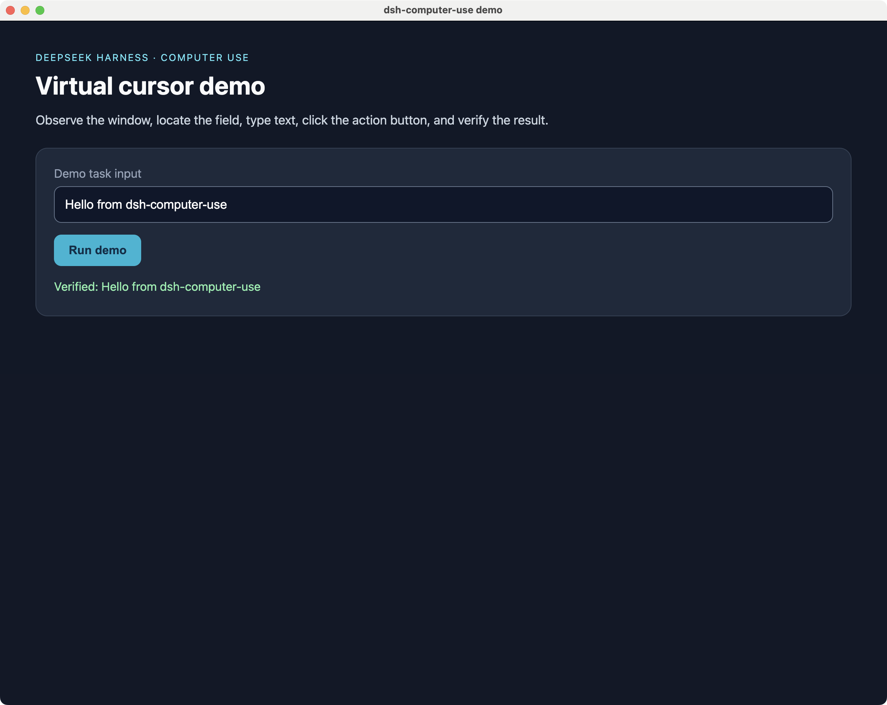

# dsh-computer-use

> 我的 DeepSeek Harness 桌面操作插件：**观察 → 编号定位 → 自动升级投递 → 验证**，全程零审批、零打断。

[](LICENSE)
[](https://nodejs.org/)
[](#平台支持)



> 源自 [988hj7tczd-oss/dsh-computer-use](https://github.com/988hj7tczd-oss/dsh-computer-use)（MIT）@`07477f4`，现为独立维护的个人项目，安全姿态与投递管线均按自有路线演进。出处与借鉴见文末[「出处与致谢」](#出处与致谢)。

## 这是什么

给 [DeepSeek Harness](https://github.com/988hj7tczd-oss/harness-desktop) 加一套可观察、可验证的桌面操作层：19 个模型友好工具，底层通过 [cua-driver](https://github.com/trycua/cua) 驱动本地桌面（独立虚拟光标，不抢真实鼠标）。Windows 深度实测——前台锁、XAML/WinUI 输入、观测几何这些硬墙都在本机踩过并解决。

三个核心机制：

1. **先观察，再操作**：动作必须基于新鲜观察快照（`element` 编号或窗口本地截图像素坐标），过期即拒绝；
2. **所见即所点**：观察输出与动作坐标共用同一"窗口本地截图像素"空间，零换算；
3. **自动升级投递**：后台优先，后台不可用自动升级前台、绕前台锁，完成后恢复用户原焦点。

## 设计立场：无感自治

不追求极致安全，方向相反。在"后台优先 + 升级链 + 恢复原前台 + 审计注记"底座上执行四原则：

| 原则 | 行为 |
|---|---|
| **易用无感** | 动作零审批、零打断；归因靠全量投递注记 + harness 会话日志 |
| **自动提权** | 投递链自动升级（恢复原前台）；观测失败自动降级桌面级采集；观测/投递能力默认全开，无模式开关 |
| **极危敏感警告** | `extremePatterns` 命中元素标签 → 结果附警告注记，**不阻断**；默认空 = 零差异 |
| **仅作基本兜底** | 凭据硬保护（密码框拒绝自动输入，**唯一硬拒绝**）、快照 TTL、无快照拒绝、`allowedApps` 白名单（默认关） |

## 能力一览

| 能力 | 说明 |
|---|---|
| 屏幕观察 | 目标窗口 AX/UIA 编号树 + 坐标；`native` 主模型直读截图；`vision` 观察者描述 |
| 区域放大 | `screen_zoom` 裁剪窗口局部为 ≤500px JPEG 直读 |
| 独立虚拟光标 | 点击/拖拽展示操作过程，不抢用户真实鼠标 |
| 文本与快捷键 | `computer_type` 走 UIA ValuePattern 后台写入（XAML/WinUI 必需）；组合键走 `hotkey` 通道（UIA AcceleratorKey 匹配） |
| 三级投递链 | background → foreground → bring_to_front 绕锁，完成后恢复原前台 |
| 观测几何根治 | 1:1 窗口截图（`max_image_dimension` 配置化），点击零标定命中 |
| 应用管理 | 列出运行中应用、后台启动、按需前置 |
| 确定性验证 | `computer_verify` / `computer_wait_for`：UIA 谓词断言与轮询（unknown 永不视为成功） |
| 剪贴板与菜单 | 剪贴板读写（粘贴流）；菜单路径直调（fail-closed） |
| 强杀开关 | `computer_stop` 锁存全部桌面操作，`computer_resume` 唯一解锁 |

## 19 个工具

| 工具 | 作用 | 主要参数 |
|---|---|---|
| `screen_observe` | 观察窗口：编号树 / 截图直读 / 视觉描述 | `window`, `mode`, `query`, `maxElements` |
| `screen_zoom` | 区域放大细看 / **树空目标定位原语** | `window_id`, `pid`, `x1`, `y1`, `x2`, `y2` |
| `computer_click` | 点击元素或坐标 | `element` 或 `x,y`；可选 `count`、`foreground` |
| `computer_double_click` | 双击 | 同上 |
| `computer_right_click` | 右键 | 同上 |
| `computer_type` | 输入文本（UIA ValuePattern 后台写入） | `text`, `element`, `foreground` |
| `computer_key` | 按键 / 快捷键（组合键走 hotkey 通道） | `key`, `foreground` |
| `computer_scroll` | 滚动 | `direction`, `amount`, `element`, `foreground` |
| `computer_drag` | 截图坐标拖拽 | `from_x/from_y → to_x/to_y`, `duration_ms`, `foreground` |
| `computer_wait` | 等待加载/动画 | `ms`（1-60000） |
| `computer_verify` | **确定性验证**：1-8 条谓词求值（satisfied/unsatisfied/unknown） | `pid`, `window_id`, `expect` |
| `computer_wait_for` | **谓词轮询等待**：满足即返回，超时结构化失败 | `expect`, `timeoutMs`, `pollMs` |
| `computer_clipboard` | 剪贴板读写（write+ctrl+v = 可靠粘贴流） | `action`, `text` |
| `computer_menu` | 菜单路径直调（fail-closed，不回退像素） | `pid`, `window_id`, `path` |
| `computer_hover` | 悬停（实验性：覆盖层 / real=真实指针） | `pid`, `window_id`, `x`, `y`, `real` |
| `computer_stop` | **强杀开关**：结束会话并锁存全部桌面操作 | 无 |
| `computer_resume` | 解锁 stop 并预热会话（唯一解锁路径） | 无 |
| `app_list` | 列出运行中的应用 | 无 |
| `app_launch` | 启动应用（后台，可选前置） | `name` / `bundle_id`, `bring_to_front` |

## 快速开始

### 前置：cua-driver

安装 [trycua/cua](https://github.com/trycua/cua) 的驱动（macOS/Linux `curl` 安装器，Windows PowerShell 安装器），或手动指定：

```bash
export CUA_DRIVER_BIN=/path/to/cua-driver
```

缺失时所有工具返回结构化错误与自救指引，不静默。

### 安装插件

```bash
git clone https://github.com/orangeofcarl0-sys/dsh-computer-use.git
cd dsh-computer-use
./install.sh --dry-run   # 预演，不写配置
./install.sh             # 链接进 profile + 注册 bundle patch
```

Windows/Linux 先 `export DSH_HOME=/path/to/dsh-home`。或按 `docs/store-evidence.md` 手动安装。装完重启宿主，用 `app_list` / `screen_observe` 验证。

## 观察模式

| 模式 | 原理 | 成本 | 适用 |
|---|---|---|---|
| `ax`（默认） | AX/UIA 树 → 编号 + 坐标 | 零视觉 token | 原生应用 |
| `native` | 截图经 attachments 持久化为图片块，主模型直读 | 图片 token | Canvas/游戏/Electron、树为空 |
| `vision` | `ctx.llm` 视觉观察者结构化描述（默认 `deepseek-v4-flash-vision-exp`，可回退 GLM） | 一次视觉调用 | 主模型不支持图片输入时 |

自动降级链：AX 树为空 → `native`（模型支持图）→ `vision`（有观察模型）→ `ax`。窗口级观测被权限/引擎拒绝时自动降级**桌面级采集**（视觉仅读，坐标系变为桌面像素，不可直接用于动作坐标），结果标注 `visualOnly` 并附 `driverAccess` 权限面探测。

## 坐标语义

所有坐标 = **窗口本地截图像素**（v0.2.0 起）：

- 原点 = 目标窗口左上角；`screen_observe` 的 `@(x,y)` 与 `computer_click(x=,y=)` 同一空间；
- 不乘 2、不加窗口偏移；
- `screen_zoom` 返回局部图，但点击坐标仍指整窗截图空间。

### 树空目标的定位环（zoom 定位原语）

主模型的整窗裸定位误差大（实测 median>300px，且为先验驱动的布局重建而非像素测量），**像素路径一律走定位环**：

```text
screen_observe（AX 树失败/树空）
  → screen_zoom(x1,y1,x2,y2)  # 取目标主导的小裁剪
  → 本图内语义确认目标 + 读出图内坐标
  → 图内坐标 × crop.scale + crop.x/y = 整窗截图像素
  → computer_click(x=,y=)（必要时 AX/视觉复核命中）
```

`screen_zoom` 结果附 `crop` 元数据（原点/尺寸/换算比例）并给出换算公式。裁剪务必让目标占画面主导——实测目标主导小裁剪误差 13-80px。

## 前后台投递

两条通道：**后台**（UIA Invoke / PostMessage，不抢焦点，后台/最小化窗口可操作）与**前台**（短暂焦点交换 + SendInput，完成后恢复原前台）。会静默丢弃后台事件的目标（Chromium/Electron 内容、GTK、VCL 等），驱动返回结构化 `background_unavailable` 而非假装成功。

| `deliveryMode` | 行为 |
|---|---|
| `auto`（默认） | 后台优先；`background_unavailable` → 自动前台重试；前台锁拦截 → `bring_to_front`（AttachThreadInput）绕锁重试，**完成后恢复原前台窗口**；全过程注记进结果 |
| `background` | 全程后台；不可用时返回结构化错误 + `foreground=true` 升级指引 |
| `foreground` | 始终前台 |

单次动作可用 `foreground: true` 覆盖。Windows 前台锁（ForegroundLockTimeout）、UIPI、XAML CoreInput 不吃 PostMessage 这些坑均已实测绕过——详见提交历史与 `WINDOWS_TEST.md`。

## 配置

```yaml
- id: dsh-computer-use
  config:
    ttlMs: 60000
    maxElements: 500
    allowedApps: []
    cursorTheme: com.dsh.computeruse.rainbow
    nativeImage: auto
    visionProvider: deepseek-official
    visionModel: deepseek-v4-flash-vision-exp
    extremePatterns: []
    deliveryMode: auto
```

| 配置项 | 默认 | 说明 |
|---|---:|---|
| `ttlMs` | `60000` | 观察快照有效期（毫秒） |
| `maxElements` | `500` | 单次观察最多返回的编号元素数 |
| `allowedApps` | `[]` | 作用域白名单；空 = 不限制 |
| `cursorTheme` | `com.dsh.computeruse.rainbow` | 虚拟光标主题；空 = 引擎默认 |
| `nativeImage` | `auto` | `auto` 超限额自动降级 / `full` 原图 / `compact` 始终小图 |
| `visionProvider` / `visionModel` | `deepseek-official` / `deepseek-v4-flash-vision-exp` | `vision` 观察者路由 |
| `extremePatterns` | `[]` | 极危清单（正则源数组）：命中元素标签 → 警告注记，不阻断 |
| `deliveryMode` | `auto` | 投递策略，见上节 |

## 平台支持

| 平台 | 状态 | 说明 |
|---|---|---|
| Windows | ✅ 深度实测 | 三级链 / XAML hotkey / 1:1 观测均在本机闭环；管理员窗口属系统边界（UIPI） |
| macOS | ✅ 已测试 | 需 Accessibility / Screen Recording 授权 |
| Linux | ✅ 已测试 | 桌面环境与 accessibility 栈影响元素识别 |

## 故障排查

| 现象 | 常见原因 | 处理 |
|---|---|---|
| `cua-driver not found` | 驱动不在 PATH | 安装驱动或设 `CUA_DRIVER_BIN` |
| 没有可见窗口 | 图形会话/窗口权限 | 确认目标在运行并重观察 |
| 快照已过期 | 超过 `ttlMs` | 重新 `screen_observe` |
| 元素编号点击失败 | 界面已变化 | 重观察取新编号 |
| AX/UIA 树为空 | Canvas/游戏/Electron | 用 `native` / `vision` |
| native 被拒 | 主模型无 image 能力 | 换视觉模型或用 `vision` |
| 动作被守卫拒绝 | 无快照/过期/白名单/凭据保护 | 按拒绝原因处理，守卫拒绝均有明确原因文本 |
| Windows 管理员窗口不可操作 | UIPI 完整性级别更高 | 使用普通用户窗口 |

## 开发与验证

```bash
npm install
npm run check                      # 语法 + 安装脚本检查
node tests/posture.smoke.mjs       # 无感自治姿态（12 断言，离线）
node tests/delivery-chain.smoke.mjs # 三级投递链（3 断言，离线）
node verify-runtime.mjs            # 运行时验证（需真实 harness + cua-driver）
```

## License

[MIT](LICENSE)。个人项目，与 DeepSeek 无关。

---

# English (brief)

Personal Computer Use plugin for the DeepSeek Harness: 19 model-friendly tools driving local desktops through [cua-driver](https://github.com/trycua/cua) with an isolated virtual cursor. Windows-deep-tested.

**Stance — zero-friction autonomy**: no approval prompts, no interruptions; capabilities always on (auto desktop-level observation fallback, three-tier delivery escalation that restores the previous foreground). The only hard refusal is automated typing into password fields. `extremePatterns` adds non-blocking warning notes.

**Loop**: `screen_observe` (AX/UIA index tree, native screenshot read, or vision observer) → act via `element` index or window-local screenshot pixels → auto-escalated delivery → observe again to verify.

**Install**: install cua-driver, then `git clone https://github.com/orangeofcarl0-sys/dsh-computer-use.git && ./install.sh` (set `DSH_HOME` on Windows/Linux). Config defaults: `ttlMs: 60000`, `deliveryMode: auto`, `extremePatterns: []` — see the Chinese section above for the full table.

Derived from [988hj7tczd-oss/dsh-computer-use](https://github.com/988hj7tczd-oss/dsh-computer-use) (MIT); see [Acknowledgements](#出处与致谢).

---

## 出处与致谢

**原仓库（代码基座）**

- [988hj7tczd-oss/dsh-computer-use](https://github.com/988hj7tczd-oss/dsh-computer-use) @ `07477f4`（MIT）——本项目的直接前身。按 MIT 派生后独立演进：安全姿态、投递管线、观测几何均与本仓库自有路线重写，与上游互不合并；原始问题反馈（#7 resolveBin、#8 hotkey 通道）已提回上游跟踪。

**运行时底座**

- [trycua/cua](https://github.com/trycua/cua)（MIT）——[cua-driver](https://cua.ai/docs/concepts/what-is-computer-use) 是本插件消费的跨平台驱动。"后台优先、升级梯子、foreground 是对观测失败的响应"的投递哲学与之同源；Windows 侧的三级链、`bring_to_front` 恢复语义、XAML hotkey 通道为本仓库在本机实测的自有实现。

**设计思想借鉴（方法与验收，不含代码）**

- [Microsoft UFO²](https://www.microsoft.com/en-us/research/publication/ufo2-the-desktop-agentos/) —— UIA∪视觉混合控制检测、GUI-API 混合执行的路线图输入；
- [Agent-S](https://www.simular.ai/articles/agent-s)（Simular，ICLR 2025）—— ACI（辅助功能树 + set-of-marks）的 grounding 兜底思路，列入后续 roadmap；
- [OSWorld](https://osworld-v1.xlang.ai/) / [Windows Agent Arena](https://microsoft.github.io/WindowsAgentArena/) —— 执行式 oracle 回归验证方法论；
- Anthropic / OpenAI CUA / Gemini computer use —— 截图循环与原子动作空间的参照系；
- ZCode 官方 computer-use 插件 —— action receipt / 观察版本化契约的重放安全设计参照。

除原仓库派生部分外，本项目不含上述项目的代码；借鉴限于思想与验收方法层面。
