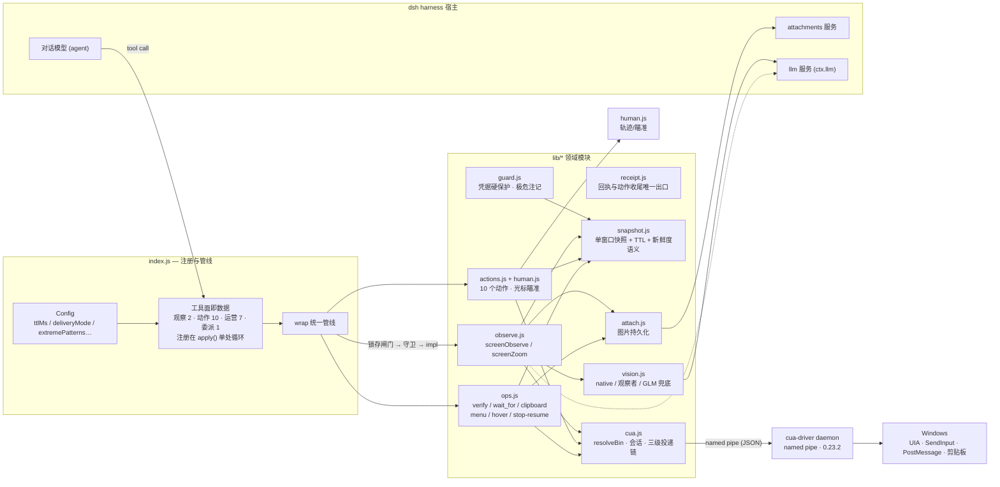
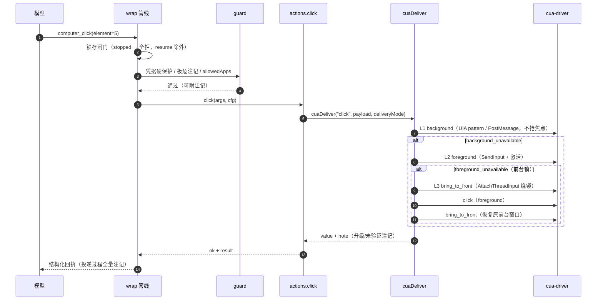
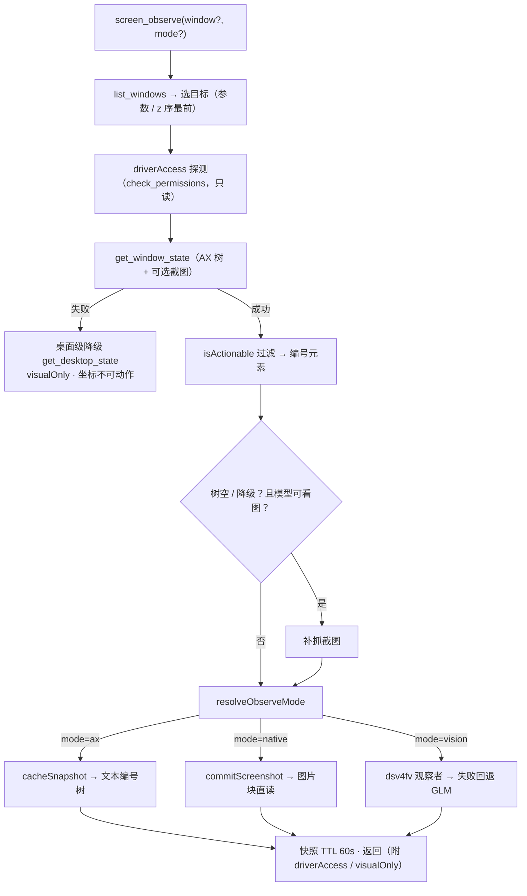
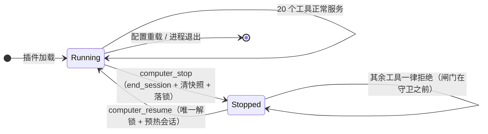

# ARCHITECTURE — dsh-computer-use

> 结构快照：v0.5.5（动态工具面：折叠态 2 / 展开态 21；依赖单向 DAG：`index.js → lib → cua-driver`，无环、无兼容层）。

## 1. 模块清单

| 文件 | 行数 | 职责 | 依赖 |
|---|---:|---|---|
| `index.js` | 738 | 配置 schema、**工具面即数据**（四组定义数组：观察 2 / 动作 10 / 运营 7 / 委派 1，注册与参数名登记在 `apply()` 单处循环）、wrap 统一管线（锁存闸门→守卫→注记回填→未知参数拒绝） | observe / actions / ops / task / guard / cua |
| `lib/observe.js` | 840 | `screenObserve`（六阶段：选目标 / 抓树 / 结构密码标记 / 元素映射 / 渲染 / 封装）、`screenZoom`（三阶段：目标解析 / 裁剪钳制 / 整窗回退）、观察降噪、桌面级兜底 | cua / snapshot / attach / vision / passwordScan |
| `lib/actions.js` | 308 | 10 个动作工具实现（click/type/key/scroll/drag/wait/app_*） | cua / human / receipt / snapshot |
| `lib/ops.js` | 183 | 确定性验证（verify/wait_for）、剪贴板、菜单直调、悬停、强杀锁存 | cua / snapshot / attach / receipt |
| `lib/cua.js` | 221 | 驱动定位（resolveBin）、会话管理、**三级投递链 cuaDeliver**、错误规范化 | node 内置 |
| `lib/engine.js` | 36 | 驱动回执判定（共享）：`engineRefusal` 识别四种拒绝/失败形态（`refusal`/`effect`/`error`/`code`）、`uiaAcceleratorTimeout` 识别 UIA 加速器超时 | — |
| `lib/surface.js` | 118 | **动态工具面两态状态机**：折叠态（computer_do + screen_observe）/ 展开态（按 agent 作用域懒注册 19 个）；幂等；连续 2 次非桌面调用自动回落；清单常量 | — |
| `lib/receipt.js` | 66 | **回执与动作收尾的唯一出口**：`receipt`（紧凑回执）、`refusalReceipt`、`settleAction`（规范化 → 判拒绝 → 标记快照消费/可疑），杜绝"某个工具漏判把拒绝上报成功" | cua / engine / snapshot |
| `lib/task.js` | 177 | `computer_task` 委派实现（子会话请求构造、结构化结果映射、降级重试、超时、每会话预算） | — |
| `lib/guard.js` | ~80 | 凭据硬保护（密码框）、极危注记、allowedApps 白名单 | snapshot |
| `lib/human.js` | 120 | 虚拟光标轨迹/点击瞄准（windowLocalOf/screenPointOf） | cua / snapshot |
| `lib/vision.js` | ~230 | native 直读 / dsv4fv 观察者 / GLM 兜底（env-only key） | node 内置 |
| `lib/snapshot.js` | 132 | 单窗口快照 + TTL + 新鲜度语义（失效原因三分类 / supersession 门禁 / 消费与可疑标记；引擎侧 element_token 双重校验） | — |
| `lib/attach.js` | 25 | 图片持久化统一出口（attachments.saveImage + 输出块装配） | — |
| `tests/lib/harness.mjs` | 131 | 测试共享脚手架（临时工作副本 / 可编程驱动桩 / 假 ctx·exec / 严格 schema 校验器） | — |
| `tests/*.mjs` | ~1200 | 离线测试共 148 断言：posture(34) / tools(15) / delivery-chain(3) / schema.conformance(20 工具×42 场景) / observe.dedup(13) / task.tool(16) / config.plumbing(25)；另 live-action e2e（真桌面 30 步） | — |

## 2. 分层与依赖

## 3. 动作请求流水线（以 computer_click 为例：三级投递链）

## 4. 观测流水线（screen_observe：模式决策与降级链）

## 5. 强杀锁存状态机（0.5.0）

## 6. 设计不变量

1. **依赖单向**：`index.js → lib → cua-driver`，lib 内无环；`snapshot.js / attach.js / vision.js` 为零内部依赖叶子。
2. **闸门顺序恒定**：锁存 → 守卫 → 实现——任何新工具自动继承，无旁路。
3. **fail-closed**：验证 unknown ≠ 成功；投递失败结构化回执；菜单直调不回退像素。
4. **归因**：所有升级/降级/未验证/凭据邻近事件以注记进结果与会话日志。
